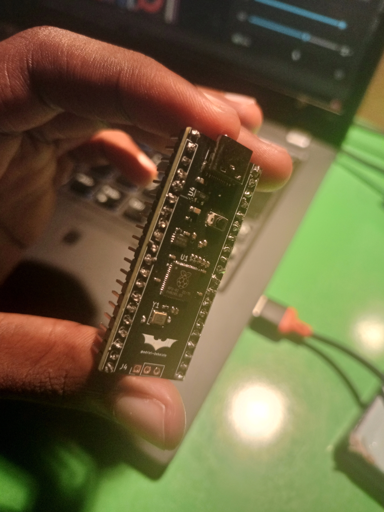
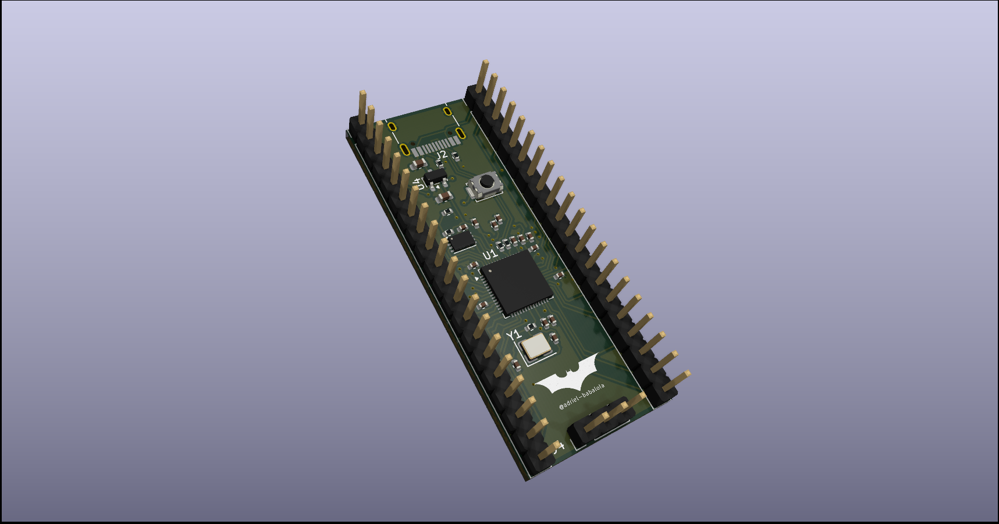
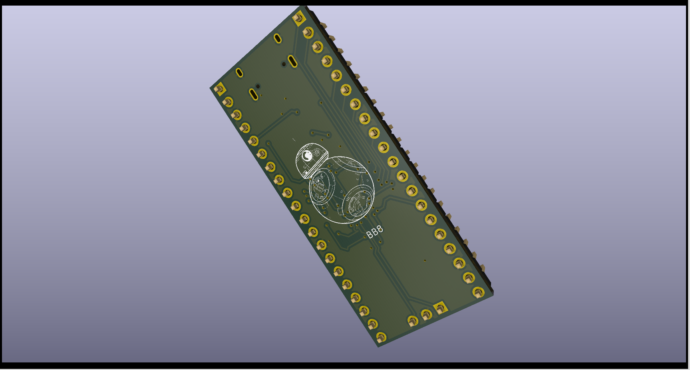
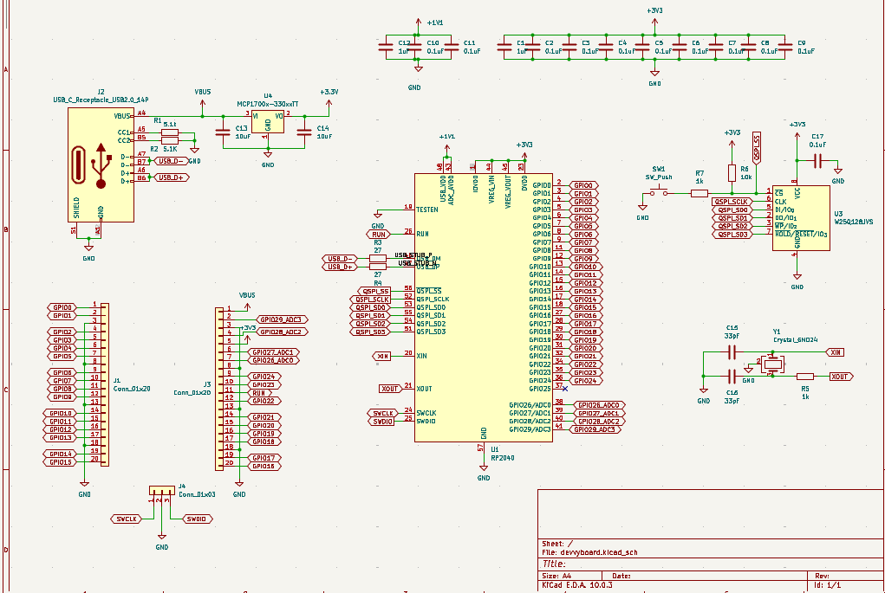
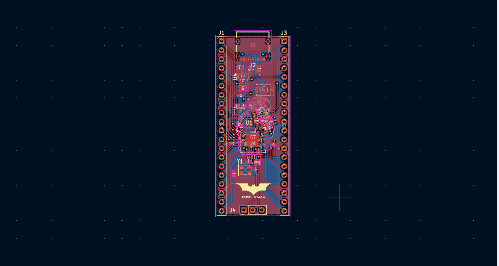

## What is it ?
The rp2040 dev board is  a micro-controller unit that consist of the rp2040 micro processor, the 16Mbit SPI NOR Flash, a crystal oscillator that synchronizes communication in the board between the USB abd rp2040, a voltage regulator, reset and boot switch.

##  Why i built it ?
I built devvy, to understand in depth what exactly goes on in a micro-controller, and how exactly do teh components interact, and now i understand what goes on behind the scenes plus i made a rp2040 dev board.

## Assembly Instructions
1. PCB Assembly: All 0402/0603 SMD components soldered by PCBWay PCBA
2. Manual Soldering: 
   - pin Headers 
3. Testing: Apply 5V via USB-C, probe 3V3 rail with multimeter (should show 3.3V), but I tested it with an LED on the 3v3 and it works fine, will proceed to much complex projects later on.
4. Firmware: Flash using RP2040 USB bootloader (hold BOOT, press RESET, drag `.uf2` to `RPI-RP2` drive)

## CAD & Design Files
- PCB Design : KiCAD – see `devvyboard/` folder
- Gerbers: `devvyboard_gebers.zip`
- 3D CAD: `.step` files in `devvyboard_3d_step/` folder

## The Final Soldered Borad

## The CAD View 

## The Schematics 

## The Final Routed PCB

## Bill of Materials

| Name | Purpose | Qty | Total (USD) | Link | Distributor |
|------|---------|-----|-------------|------|-------------|
|Connectors | For external connections | 10 | $1.5 | [Connectors](https://www.aliexpress.com/item/1005007385580884.html?spm=a2g0o.cart.0.0.79ee38dam50Q6e&mp=1&pdp_npi=6%40dis%21USD%21USD+1.49%21USD+1.49%21%21USD+1.49%21%21%21%40211b813f17779407648131433e0a86%2112000040529096976%21ct%21NG%216441071228%21%211%210%21) | Aliexpress
|Soldering Iron | To Solder | 1 | $5.3 | [Soldering Iron](https://www.aliexpress.com/item/1005009943749655.html?spm=a2g0o.cart.0.0.79ee38dam50Q6e&mp=1&pdp_npi=6%40dis%21USD%21USD%2019.66%21USD%205.24%21%21USD%205.24%21%21%21%40211b813f17779407648131433e0a86%2112000050645810711%21ct%21NG%216441071228%21%211%210%21) | Aliexpress
| RP2040 | Dual-core ARM Cortex-M0+ microcontroller — the brain of the board | 1 | $0.69 | [LCSC C2040](https://www.lcsc.com/product-detail/C2040.html) | JLCPCB |
| W25Q16JVUXIQ Flash | 16Mbit SPI NOR Flash — stores firmware and data | 1 | $0.18 | [LCSC C2843335](https://www.lcsc.com/product-detail/C2843335.html) | JLCPCB |
| 12MHz Crystal (X322512MSB4SI) | Crystal oscillator — synchronises USB and RP2040 communication | 1 | $0.04 | [LCSC C9002](https://www.lcsc.com/product-detail/C9002.html) | JLCPCB |
| TYPE-C-31-M-12 USB-C Receptacle | USB-C port — data transfer and board power input | 1 | $0.09 | [LCSC C165948](https://www.lcsc.com/product-detail/C165948.html) | JLCPCB |
| MCP1700T-3302E/TT LDO | 3.3V voltage regulator — powers all 3.3V components | 1 | $0.18 | [LCSC C39051](https://www.lcsc.com/product-detail/C39051.html) | JLCPCB |
| Alps SKRKAHE020 Tactile Switch | Reset/boot switch — resets or boot-selects the RP2040 | 1 | $0.08 | [LCSC C202388](https://www.lcsc.com/product-detail/C202388.html) | LCSC |
| 100nF 0402 Capacitor x11 | Decoupling — filters noise on power rails | 11 | $0.02 | [LCSC C1525](https://www.lcsc.com/product-detail/C1525.html) | JLCPCB |
| 1uF 0402 Capacitor x2 | Bulk decoupling — stabilises power at RP2040 and USB | 2 | $0.02 | [LCSC C52923](https://www.lcsc.com/product-detail/C52923.html) | JLCPCB |
| 10uF 0603 Capacitor x2 | Input/output bulk capacitance — LDO stability | 2 | $0.02 | [LCSC C19702](https://www.lcsc.com/product-detail/C19702.html) | JLCPCB |
| 33pF 0402 Capacitor x2 | Crystal load capacitors — correct oscillator loading | 2 | $0.01 | [LCSC C1557](https://www.lcsc.com/product-detail/C1557.html) | JLCPCB |
| 5.1k 0402 Resistor x2 | USB-C CC resistors — identifies board as USB device to host | 2 | $0.01 | [LCSC C25905](https://www.lcsc.com/product-detail/C25905.html) | JLCPCB |
| 27R 0402 Resistor x2 | USB D+/D- series resistors — USB signal integrity | 2 | $0.01 | [LCSC C352446](https://www.lcsc.com/product-detail/C352446.html) | JLCPCB |
| 1k 0402 Resistor x2 | Current limiting / pull resistors | 2 | $0.01 | [LCSC C11702](https://www.lcsc.com/product-detail/C11702.html) | JLCPCB |
| 10k 0402 Resistor | Pull-up/pull-down bias resistor | 1 | $0.01 | [LCSC C25744](https://www.lcsc.com/product-detail/C25744.html) | JLCPCB |
| PCB Fabrication (devvyboard_Y4) | 2-layer PCB — the board itself | 5 | $2.00 | — | JLCPCB |
| PCBA SMT Assembly | SMT assembly of all SMD components | 2 | $80.06 | — | JLCPCB |
| Shipping PCB | Economical Global Direct Line 14-19 business days | - | $13.10 | — | JLCPCB |
|Shipping Aliexpress | - | - | $5.23 | - | Aliexpress
| **TOTAL** | | | **$107.36** | | |